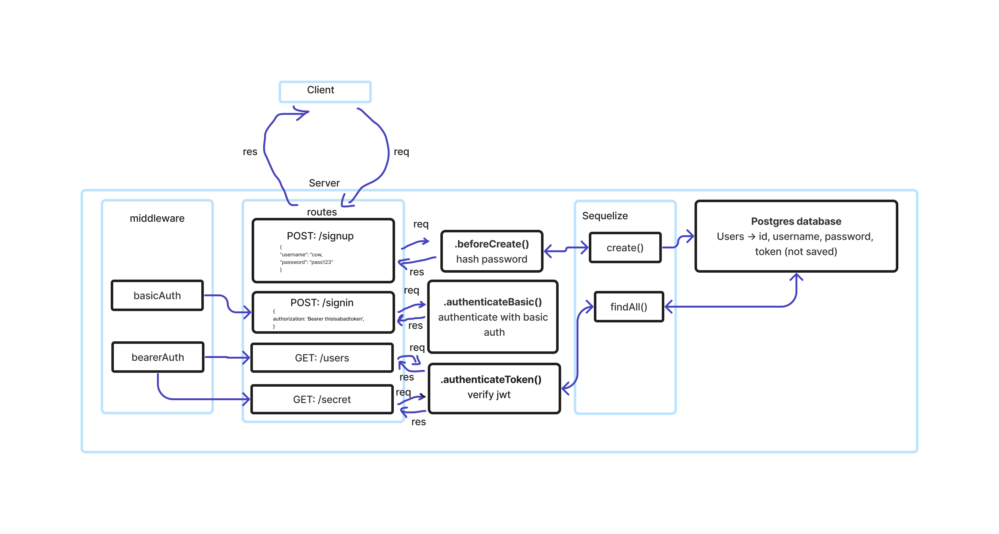

# LAB - Class 7

## Project: Bearer Auth

### Author: Jelani Rhinehart

### Problem Domain  

In this phase, the new requirement is that any user that has successfully logged in using basic authentication (username and password) is able to continuously authenticate … using a “token”

Task 1: Fix The Bugs

Task 2: Secure the JWT Tokens

### Links and Resources

- [GitHub Actions ci/cd](https://github.com/Jchips/bearer-auth/actions)
- [back-end server url](https://bearer-auth-dev-0wtk.onrender.com)
- [Pull Request](https://github.com/Jchips/bearer-auth/pull/2)

### Setup

#### `.env` requirements

- PORT:enter-whatever-port-you-want
- DATABASE_URL=postgres-database-url
- SECRET=a-secret-for-jwt-tokens

#### How to initialize/run your application

- `nodemon` (if installed) OR
- `npm start`

#### Features / Routes

- What was your key takeaway?

    My key takeaway is how to set up bearer authentication and how to write tests for it, and how to implement single use tokens.

- Pull request

  Link: <https://github.com/Jchips/api-server/pull/3>

- POST : `/signup` - Sign up a user
- POST : `/signin` - Sign in with a user that already signed up
- GET : `/users` - Displays all user names only for users with tokens
- GET : `/secret` - Displays a secret message only for users with tokens

#### Tests

- How do you run tests?
`npm test`
- Any tests of note?
  - POST to /signup to create a new user.
  - POST to /signin to login as a user (use basic auth).
  - GET to /users to display all users if a user has a token.
  - GET to /secret to display a secret for users who have tokens.
  - Tests the middleware functions (BasicAuth and BearerAuth).

#### UML

